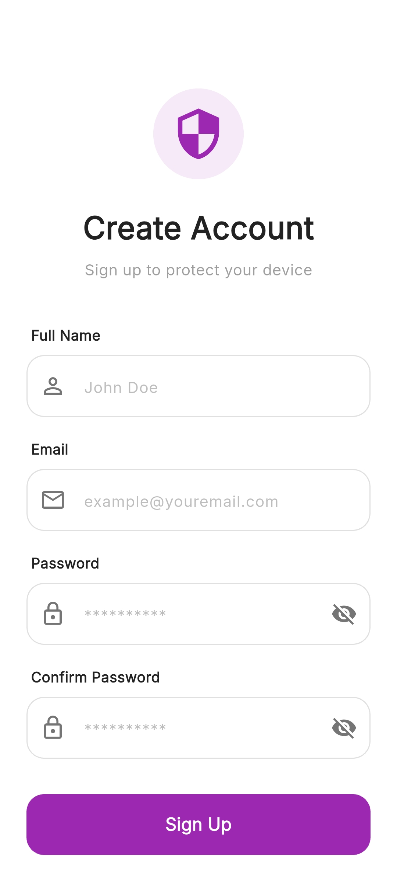
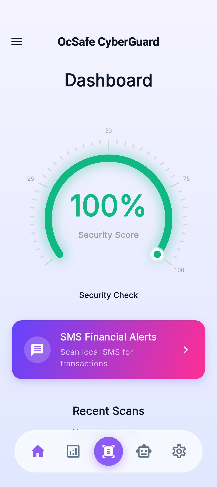
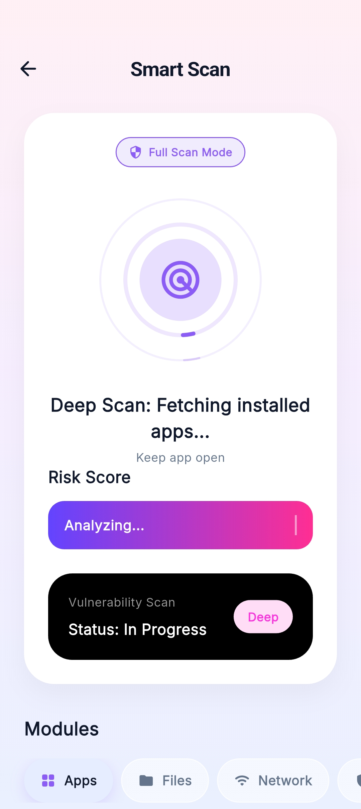
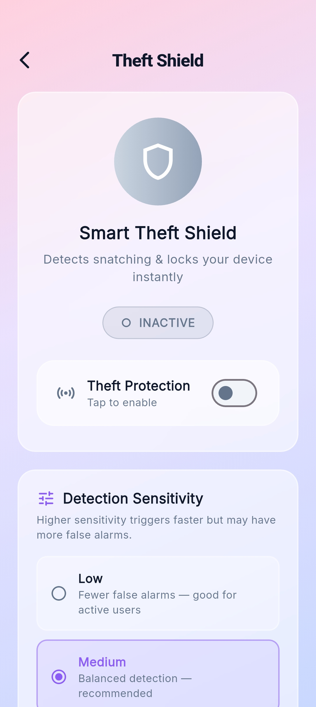

# 🛡️ OCSafe-Cyberguard (Mobile Security App)

<p align="center">
  
  
  
</p>

**OCSafe-Cyberguard** is a comprehensive mobile security application built with Flutter. It provides deep system insights, theft protection, and continuous monitoring to keep your device safe. 

## 💡 How It Works

OCSafe-Cyberguard is engineered to act as a proactive shield for your smartphone, blending on-device analysis with cloud threat intelligence:

- 🔍 **Smart Scanning (Static Analysis & VirusTotal)**: 
  The app extracts the APKs of installed applications and performs deep static analysis locally. It analyzes the Android Manifest to detect suspicious permission combinations (e.g., a calculator app requesting SMS access). It then generates a file hash and queries the **VirusTotal API** to check for crowd-sourced malicious reputation, storing results locally in SQLite for fast caching.
- 🚨 **Theft Shield (Motion-Triggered Device Lock)**:
  By utilizing the device's built-in accelerometer and gyroscope sensors, the `MotionAnalyzer` continuously monitors for sudden, aggressive movements indicative of a phone being snatched from your hand. If a snatch is detected, the app uses native platform channels to instantly **force-lock the device**, ensuring a thief cannot access your unlocked phone.
- 🌐 **Safe Browsing & SMS Phishing Detection**:
  The app parses incoming SMS messages for known financial fraud patterns and checks domains against a custom-built Safe Browsing engine to detect phishing links.

## ✨ Core Features

- 📱 **Deep Device Scanning**: Comprehensive static APK analysis paired with VirusTotal cloud intelligence.
- 🚨 **Smart Theft Shield**: Snatch-detection algorithms that instantly lock the device via native Android APIs.
- 🔐 **Privacy-First Data Storage**: Caches scan histories and activity logs securely on-device using SQLite and Secure Storage.
- ☁️ **Cloud Sync**: Firebase integration for seamless user authentication and secure profile data syncing.
- 🔔 **Real-Time Monitoring**: Background services that alert you to phishing attempts and suspicious SMS messages instantly.

## ⚠️ Important Installation Note (Play Protect)

Because OCSafe-Cyberguard includes powerful **Theft Protection** features that require deep system access (such as reading installed apps, telephony, and sensor data), **Google Play Protect may block the installation of the APK**.

**To successfully install the app on an Android device:**
1. Open the **Google Play Store** app.
2. Tap on your profile icon in the top right.
3. Select **Play Protect** > Settings (Gear icon).
4. Temporarily disable **"Scan apps with Play Protect"**.
5. Install the OCSafe-Cyberguard APK.
*(You can re-enable Play Protect after the installation is complete and permissions are granted).*

## 💻 Tech Stack & Libraries

- **Framework**: Flutter & Dart
- **State Management**: Provider
- **Backend as a Service**: Firebase (Auth & Firestore)
- **Local Database**: SQFlite (SQLite) & Flutter Secure Storage
- **Threat Intelligence**: **VirusTotal API** integration for cloud reputation analysis
- **App Security Engine**: 
  - `archive` (for local static APK analysis and extraction)
  - Safe Browsing / Phishing Detection (custom built-in engine)
- **System Interactions & Hardware**:
  - `device_apps`, `device_info_plus`, `battery_plus`, `sensors_plus`, `telephony` (SMS parsing)
  - `permission_handler` (for granular permission control)
- **Notifications**: `flutter_local_notifications`
- **Networking**: `http` (REST APIs)

## 📂 Project Structure

```text
lib/
├── core/       # Core application configuration and themes
├── models/     # Data models for the application
├── providers/  # State management providers
├── screens/    # UI screens and views
├── security/   # Security logic, theft protection algorithms
├── services/   # External API and Firebase services
├── utils/      # Helper functions and constants
├── widgets/    # Reusable UI components
└── main.dart   # Application entry point
```

## 🚀 Getting Started

### Prerequisites
- Flutter SDK (^3.11.0)
- Android Studio or VS Code
- Android SDK

### Installation
1. **Clone the repository:**
   ```bash
   git clone https://github.com/PurveshShinde/OCSafe-Cyberguard.git
   cd OCSafe-Cyberguard
   ```

2. **Install dependencies:**
   ```bash
   flutter pub get
   ```

3. **Run the application:**
   ```bash
   flutter run
   ```

### Build Release APK
```bash
flutter build apk --release
```
The generated APK will be located at `build/app/outputs/flutter-apk/app-release.apk`.

## 📸 Screenshots

| Create Account | Dashboard |
|:---:|:---:|
|  |  |
| **Smart Scan** | **Theft Shield** |
|  |  |

## 🤝 Contributors

<table align="center">
  <tr>
    <td align="center"><a href="https://github.com/PurveshShinde"><br /><sub><b>Purvesh Shinde</b></sub></a></td>
    <td align="center"><a href="https://github.com/Sanjana2616"><br /><sub><b>Sanjana More</b></sub></a></td>
    <td align="center"><a href="https://github.com/ShreyaMShinde"><br /><sub><b>Shreya Shinde</b></sub></a></td>
    <td align="center"><a href="https://github.com/ganesh121103"><br /><sub><b>Ganesh Patil</b></sub></a></td>
</table>

## 📄 License
This project is licensed under the MIT License.
